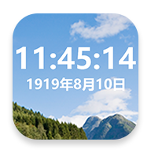

## fakelauncher
*你自己看，这绝对是个老人机，不是智能机啊*

**把你的伪老机（老人机外貌但是有智能系统）伪装成一个真正的老人机**

> [!Caution]
> **不要尝试在真智能手机上运行这个App，等会没实体按键退不出去就老实了**
> 
> **如果因为这个软件导致你的手机出现问题，本人概不负责**

## 介绍

把你的伪老机（老人机外貌但是有智能系统）伪装成一个真正的老人机

启动App后，就会进入一个仿老人机的界面，其他App全都打不开，状态栏拉不下来，触屏也没用，只能按键操控，达到伪装效果

所以这玩意有啥用，适用于哪些设备呢？下面我举个栗子

## 适用设备

这里有款应该算是耳熟能详的老人机：

| 项目 | 参数 |
| --- | --- |
| 名称 | TCL onetouch E1 5G |
| 代号 | T508N |
| SoC | Unisoc T157 (ums9620) |
| Android 版本 | 13 Tiramisu |

可以发现，这玩意**长得像个老人机**但其实有高达安卓13的系统，还是64位系统，还支持5G（至于为什么强调64位，问就是64位SoC跑32位系统的痛）。这意味着，这玩意完全能当个正常手机用，**装游戏、抖音B站、微信QQ都没问题**

基于这个牛逼的特性，有一批高中生就买这类老人机带学校里玩，啊当然也包括我。但是这玩意长得像老人机，但他UI完全就是普通手机啊，如果哪天老师看到你这玩意是个智能机系统那你不炸了？

为了解决这个Bug，`fakelauncher`就此被开发出来了

## 食用方法

1. 安装好之后，去Xposed里激活它（推荐用LSPosed，因为我只测试过用它）。记得重启！
2. 打开`FakeL Settings`并给予所有权限
3. 随便找个按键映射软件（例如`Xposed Edge Pro`）然后绑定个按键用来启动fakelauncher (com.wtbruh.fakelauncher.SplashActivity)。搞好之后，你就获得了一个老人机界面
4. 如果你想退出去，在主屏幕按Dpad键：上上下下左右左右 就可以出去了

## 工作原理

先看看安卓原生支持的一个功能：[屏幕固定](https://support.google.com/android/answer/9455138)，但是国内可能访问不了

利用屏幕固定，就可以达到禁用状态栏并阻止打开其他App的功能了。在此使用了Xposed，hook了系统服务后检测到应用打开就会调用启动屏幕固定的方法，检测到应用退出后就会按照同样方法解除屏幕固定。

在此特别感谢开源项目：[PinningApp](https://github.com/HChenX/PinningApp)，屏幕固定相关的代码基本都抄的他的

## TO-DO

- [ ] 尝试适配Dhizuku，Shizuku等授权器，从而实现免root支持
- [ ] 远古安卓支持
- [x] 加入“*键解锁”
- [ ] 加入MP3界面样式
- [ ] ~~加入描边字体~~ 字体描边宽度可调整
- [ ] 加入联系人页面
- [ ] 加入短信页面
- [ ] 视频的进度条，照片全屏浏览时可以左右换照片，选项菜单（相册）
- [ ] Dpad操作可以自定义（退出方法）
- [ ] 相机能拍照
- [ ] 拨号盘可以打电话（但是自定义打电话的界面可能做不到）
- [x] 农历显示支持
- [x] 优化电量显示，以图标形式呈现，不显示具体电量
- [x] ~~弃用安卓自带字体，换个点阵字体上去~~ 点阵字体效果不好，还是换回来了
- [x] 增加相册页面
- [x] 增加更多退出应用的方式，例如拨号盘能输暗码退出，设置页安全密码可以设退出密码，上上下下左右左右可以自定义等等
- [x] 优化Ui部分发送taskId到Hook部分的代码，就是触发屏幕固定用的（PinningApp使用了`SettingsProvider`，相当于`adb shell settings put xxx`，UI部分使用需要`WRITE_SECURE_SETTINGS`权限支持，获取贼麻烦）

## 项目感谢
- [Android](https://source.android.google.cn/)
- [Xposed](https://github.com/LSPosed/LSPosed)
- [PinningApp](https://github.com/HChenX/PinningApp)
- [Shizuku API](https://github.com/RikkaApps/Shizuku-API)
- [Dhizuku API](https://github.com/iamr0s/Dhizuku-API)
